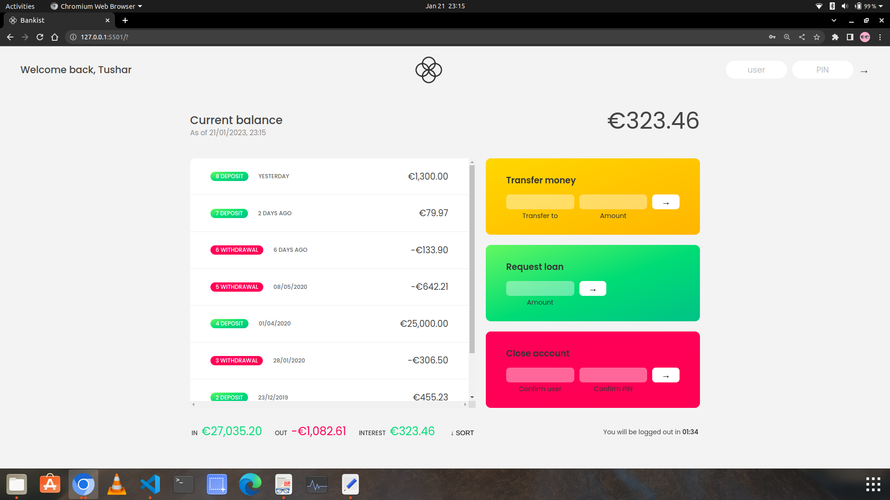

# Bankist
This project is a simulation of a basic online banking application interface. 
It demonstrates how users can interact with their accounts, perform various banking transactions, and view their financial history.

->**User Authentication**: Implemented secure login using PIN-based authentication to ensure account security.

->**Transaction History**: Displayed a comprehensive transaction history, including deposit and withdrawal details with formatted dates.

->**Balance Calculation**: Calculated and displayed real-time account balances based on transaction history.

->**Sorting Transactions**: Allowed users to sort transaction history by amount, making it easier to analyze financial activities.

->**Currency Formatting**: Formatted transaction amounts as currency using the appropriate locale and currency code.

->**Summary Display**: Presented a summary of total deposits, withdrawals, and earned interest for each account.

->**Loan Request**: Enabled users to request loans, with validation based on previous transaction history.

->**Logout Timer**: Implemented an automatic log-out timer for enhanced account security after a period of inactivity.

//sample username and password

username 1- tt
password - 1111

username 2- ss
password = 2222

Project sample 

